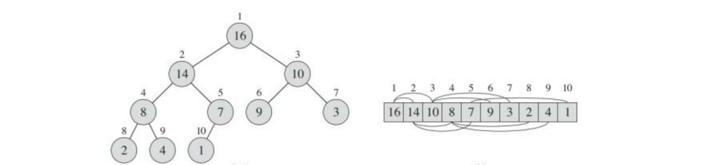
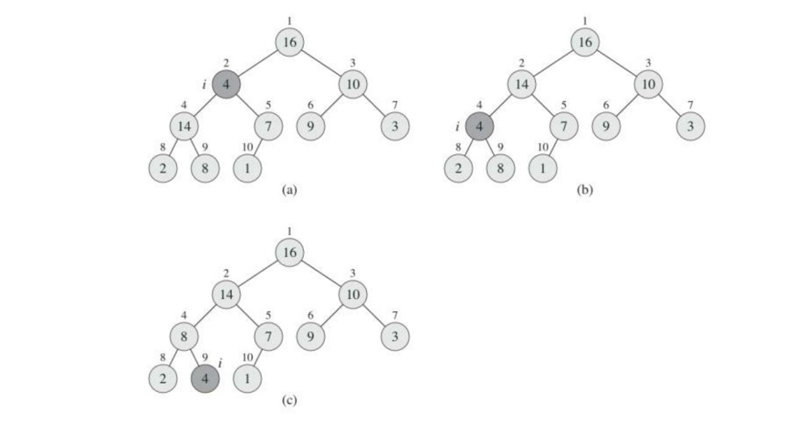
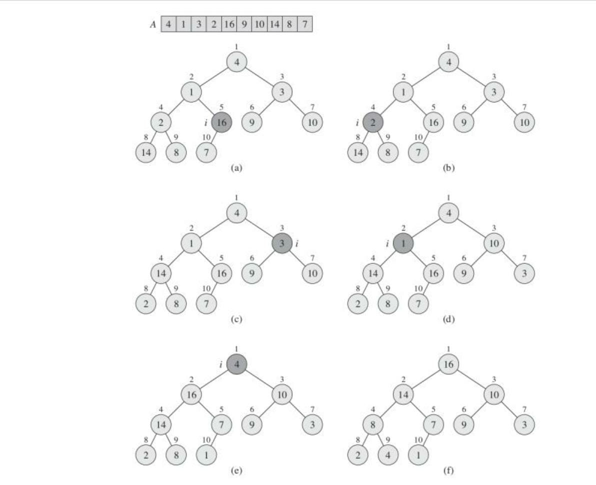
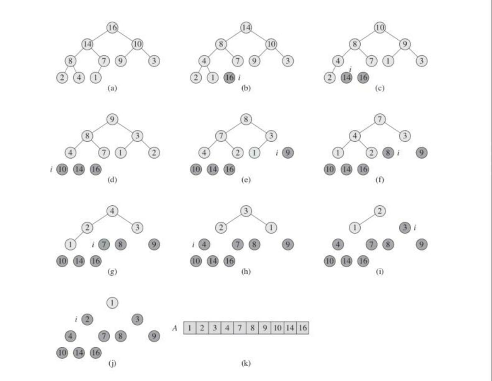

# CHAPTER 2: DATA STRUCTURES

# Heaps

The binary heap data structure is an array object that we can view as a nearly complete binary tree. Each node of the tree corresponds to an element of the array. The tree is completely filled on all levels except possibly the lowest, which is filled from the left up to a point. An array $A$ that represents a heap is an object with two attributes: $A.length$, which (as usual) gives the number of elements in the array, and $A.heap-size$, which represents how many elements in the heap are stored within array $A$. The root of the tree is $A[1]$



**Max Heap:** For every node $i$, $A[parent(i)] \geq A[i]$

**Min Heap:** For every node $i$, $A[parent(i)] \leq A[i]$

## Maintaining the heap property (Heapify)

*For a Max Heap:*
Its inputs are an array $A$ and an index $i$ into the array. When it is called, it assumes that the binary trees rooted at L $LEFT(i)$ and $RIGHT(i)$ are max-heaps, but that $A[i]$ might be smaller than its children, thus violating the max-heap property. The algorithm lets the value at $A[i]$ “float down” in the max-heap so that the subtree rooted at index $i$ obeys the max-heap property.



### Building a Max Heap

We can use the procedure of heapify in a bottom-up manner to convert an array $A[1..n]$, where $n = A.length$, into a max-heap.



**Implementation:**

```c++
#include <bits/stdc++.h>
#include <iostream>

int heap[100000];
int num_elements = 0;

int get_left_child(int a)
{
    return 2 * a;
}

int get_right_child(int a)
{
    return 2 * a + 1;
}

int get_parent(int a)
{
    return a / 2;
}

void insert(int a)
{
    num_elements++;
    heap[num_elements] = a;
    int position = num_elements;
    while (true)
    {
        int par = get_parent(position);
        if (par != 0 && heap[par] < heap[position])
        {
            swap(heap[par], heap[position]);
        }
        else
            break;
        position = par;
    }
}

void del_top()
{
    if (num_elements == 0)
        return;
    swap(heap[1], heap[num_elements]);
    num_elements--;
    int position = 1;
    while (true)
    {
        int a = get_left_child(position);
        int b = get_right_child(position);
        int final_index;
        if (a > num_elements)
            break;
        else if (b > num_elements)
            final_index = a;
        else
            final_index = (heap[a] > heap[b]) ? a : b;
        if (heap[final_index] > heap[position])
            swap(heap[position], heap[final_index]);
        else
            break;
        position = final_index;
    }
}

void heapify()
{
    for (int i = num_elements; i >= 1; i--)
    {
        int position = i;
        while (true)
        {
            int a = get_left_child(position);
            int b = get_right_child(position);
            int final_index;
            if (a > num_elements)
                break;
            else if (b > num_elements)
                final_index = a;
            else
                final_index = (heap[a] > heap[b]) ? a : b;
            if (heap[final_index] > heap[position])
                swap(heap[position], heap[final_index]);
            else
                break;
            position = final_index;
        }
    }
}

int get_top()
{
    if (num_elements)
    {
        return heap[1];
    }
    else
    {
        return -1;
    }
}

void solve()
{
    int n;
    cin >> n;
    num_elements = n;
    for (int i = 0; i < n; i++)
    {
        cin >> heap[i + 1];
    }
    heapify();
    for (ll i = 1; i < n + 1; i++)
    {
        cout << heap[i] << " ";
    }
}

int main(void)
{
    solve();
    return 0;
}
```

## Heapsort

The heapsort algorithm starts by building a max-heap on the input array $A[1...n]$, where $n = A.length$. Since the maximum element of the array is stored at the root $A[1]$, we can put it into its correct final position by exchanging it with $A[n]$. If we now discard node n from the heap—and we can do so by simply decrementing $A.heap-size$ we observe that the children of
the root remain max-heaps, but the new root element might violate the max-heap property. All we need to do to restore the max-heap property, however, is call the heapify function, which leaves a max-heap in $A[1...n-1]$. The heapsort algorithm then repeats this process for the max-heap of size $n-1$ down to a heap of size 2.

> Complexity: $O(n*log(n))$


