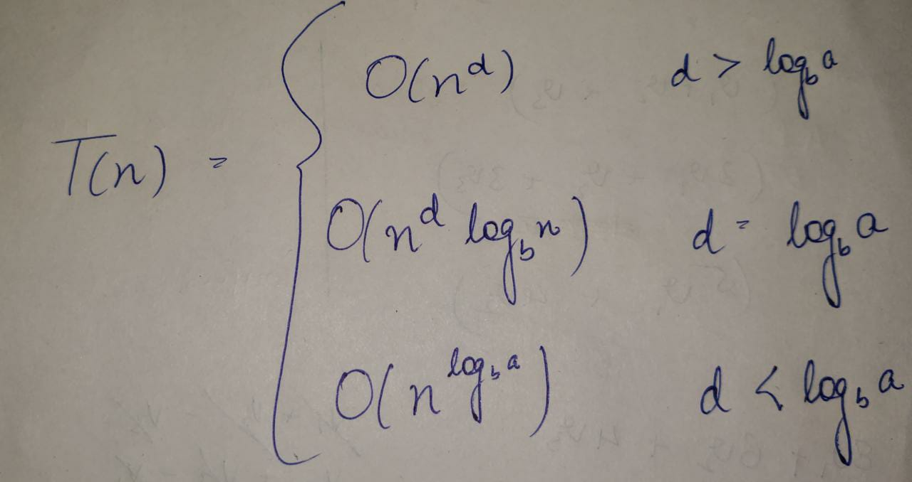
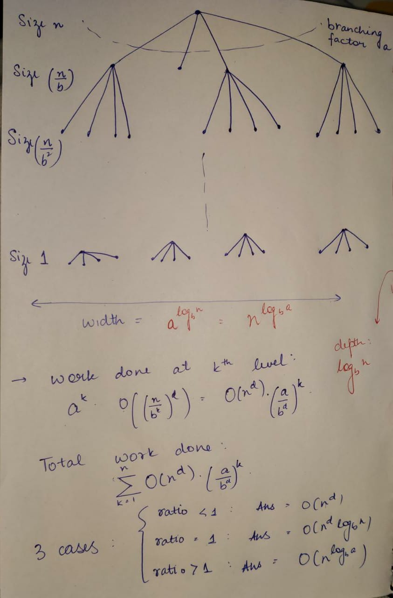
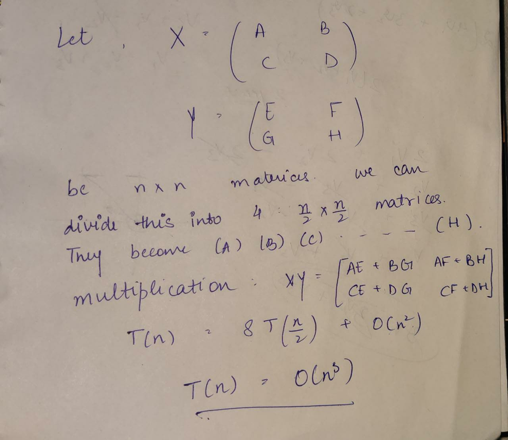
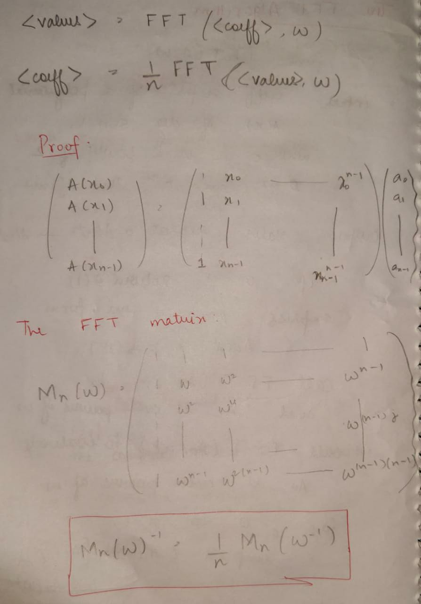

# CHAPTER 3: DIVIDE AND CONQUER

A divide and conquer algorithms breaks down a bigger problem into smaller subproblems. We solve these simpler subproblems, and combine the solutions to these subproblems to get the final solution. It is used in many algorithms such as sorting (mergesort), fast fourier transform, etc. We shall now be looking at these algorithms to understand the concept of divide and conuqer algorithms.

First we will have a look at the Master Theorem which is useful in finding the complexity of the algorithms.

## Master Theorem

Given the recureence relation, this theorem helps us in finding the complexity of our solution.

Given the recuurence relation:
$T(n) = a*T(n/b) + O(n^d)$



**Proof:**



## Mergesort

- Split the array into two equal halves
- Sort them recursively
- Merge the two sorted halves

Complexity: $T(n) = 2T(n/2) + O(n)$
> By Master Theorem, complexity = O(nlogn)


### Code
```c++
#include <iostream>
using namespace std;

void printArray(int A[], int n)
{
    for (int i = 0; i < n; i++)
    {
        cout << A[i] << " ";
    }
    cout << endl;
}

void merge(int A[], int start, int end)
{
    int mid = (end + start) / 2;

    int *B = new int[end - start + 1];

    int index = 0;

    int i = start;
    int j = mid + 1;

    int n1 = mid + 1;
    int n2 = end + 1;

    while (i < n1 && j < n2)
    {
        if (A[i] <= A[j])
        {
            B[index] = A[i];
            i++;
        }
        else
        {
            B[index] = A[j];
            j++;
        }
        index++;
    }

    while (i < n1)
    {
        B[index] = A[i];
        i++;
        index++;
    }
    while (j < n2)
    {
        B[index] = A[j];
        j++;
        index++;
    }

    for (int k = 0; k < index; k++)
    {
        A[start] = B[k];
        start++;
    }

    delete[] B;
}

void mergeSort2(int A[], int start, int end)
{
    if (start >= end)
        return;

    int mid = (end + start) / 2;

    mergeSort2(A, start, mid);
    mergeSort2(A, mid + 1, end);

   // printArray(A, (end - start + 1));

    merge(A, start, end);
}

void mergeSort(int input[], int len)
{

    mergeSort2(input, 0, len - 1);
}

int main()
{
    int length;
    cin >> length;
    int *input = new int[length];
    for (int i = 0; i < length; i++)
        cin >> input[i];
    mergeSort(input, length);
    for (int i = 0; i < length; i++)
    {
        cout << input[i] << " ";
    }
}
```


### Why $\Omega(n\log n)$ is the lower bound for comparison based sort

Any comparison based sorting algorithm has to make at least $n*logn$ comparisons.

- There are at max $n!$ permutations, so the answer can be any 1 of these permutations
- Lets say we have an algorithm that did k comparisons. So there can be $2^k$ comparison strings.
- $2^k$ should at least equal to $n!$, otherwise we may miss out on the soultion.
- This is implies that minimum $nlogn$ comparisons are needed.

## Matrix multiplication

> Complexity of the Naive Algo: $O(n^3)$

Naive is $O(n^3)$ because it takes $O(n)$ to populate one element in the product matrix.

### Divide and conquer method



> Complexity: $O(n^3)$


## The Fast Fourier Transform Algorithm

**func FFT(A,w)**:

input: coeffecient representation of a polynomial $A(x)$ of degree $<= n-1$, where n is a power of 2.

w(omega), is the nth root of unity.

output: value representation of the polynomial $( A(w^0), A(w^1),......,A(w^n-1))$

if w = 1: return A(1);

express $A(x)$ as $Ae(x^2) + x(Ao)(x^2)$

call FFT(Ae,$w^2$); to evaluate Ae at even powers of w

call FFT(A0,$w^2$); to evaluate Ao at even powers of w

for j=0 to n-1:

compute $A(w^j) = [ Ae(w^2j) + (w^j)Ao(w^2j)]$

return $A(w^0), ....... , A(w^n-1)$;

> Complexity: $O(dlogd)$; for multiplying 2 d-degree numbers




## Example Problem

[Question](https://codeforces.com/problemset/problem/768/B)

### Solution
```c++
#include<bits/stdc++.h>
using namespace std;
long long int cnt(long long int temp) //returns the length of final list 
{
  long long int x=1;
  while(temp>1)
  {
    temp/=2;
    x*=2;
  }
  return x;
}
int is_one(long long int pos,long long int target,long long int num)
{ 
  if(num<2)
    return num;
  if(pos+1==2*target)
  {
    return num%2;
  }
  num/=2;
  pos/=2;   
  if(target>pos+1)
      target-=(pos+1);      
  return is_one(pos,target,num);
}

int main()
{
  long long int l,r,n,x,ans=0,i;
  cin>>n>>l>>r;
  x=cnt(n);
  x=2*x-1;
  for(i=l; i<=r; i++)  ans+=is_one(x,i,n);
  cout<<ans<<endl;  
  return 0;
}
```

## Practice Problems

The questions are sorted by difficulty.

[Problem 1](https://codeforces.com/problemset/problem/559/B)

[Problem 2](https://codeforces.com/problemset/problem/1042/D)

[Problem 3](https://codeforces.com/problemset/problem/873/D)