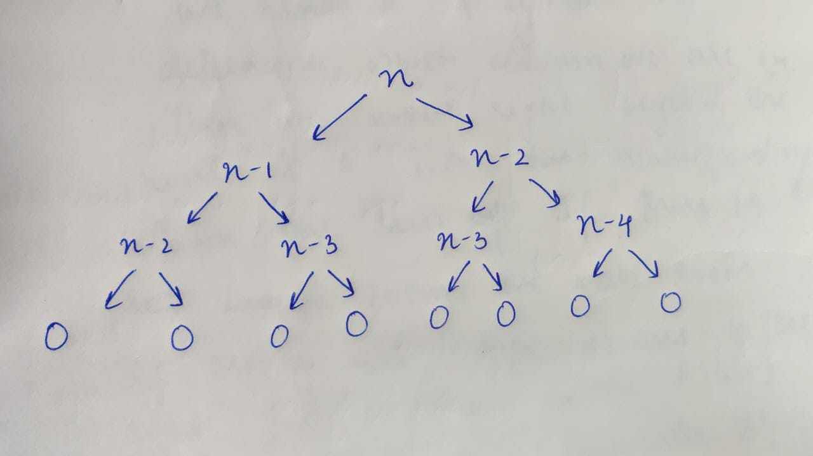
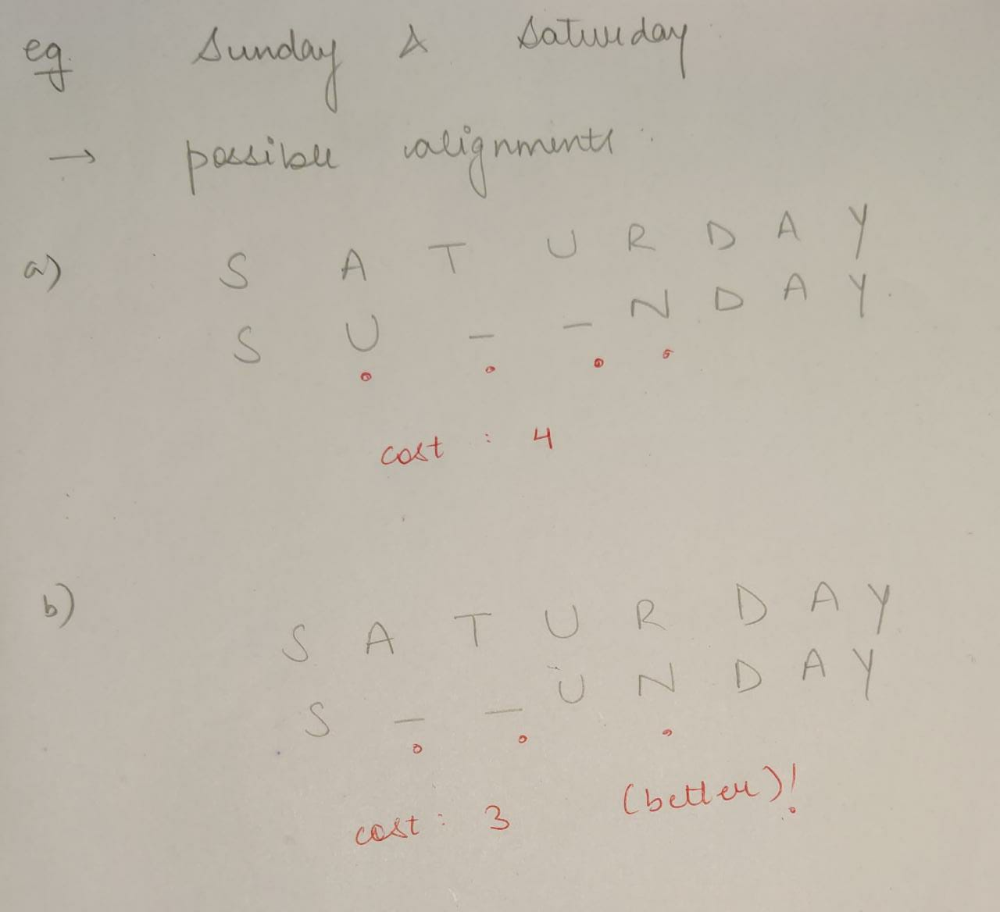
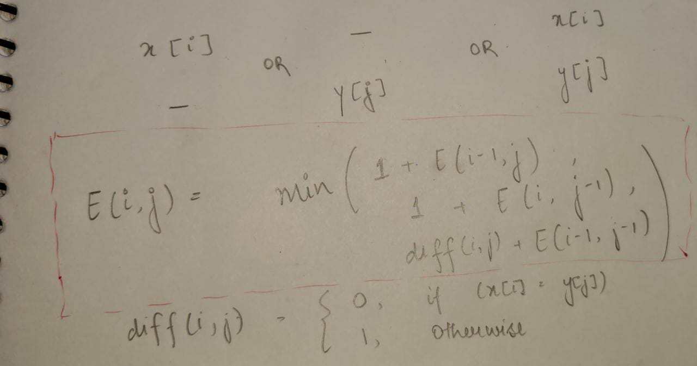

# CHAPTER 5: DYNAMIC PROGRAMMING

Let us consider the problem of calculating Fibonacci numbers.
For fibonacci numbers:

fib(0) = $0$

fib(1) = $1$

fib($n$) = fib($n-1$) + fib($n-2$) for all $n>=2$

Now, let us try to write code for calculating them. One method is to use recursion.

```c++
#include <iostream>
using namespace std;

int fibo(int n)
{
    if (n < 2)
    {
        return n;
    }

    int a = fibo(n - 1);
    int b = fibo(n - 2);

    return a + b;
}

int main()
{
    int n;
    cin >> n;

    cout << fibo(n) << endl;
}
```

Here, for every n, we need to make a recursive call to f(n-1) and f(n-2).

For f(n-1), we will again make the recursive call to f(n-2) and f(n-3). Similarly, for f(n-2), recursive calls are made on f(n-3) and f(n-4) until we reach the base case. The recursive call diagram will look something like shown below:



At every recursive call, we are doing constant work($k$)(addition of previous outputs to obtain the current one). At every level, we are doing $2^nK$ work (where $n$ = 0, 1, 2, …). Since reaching $1$ from $n$ will take $n$ calls, therefore, at the last level, we are doing $2^xk$ ($x$ = $n-1$) work. 

> Total Work = $2^nk$

> Time Complexity: $O(2^n)$

Clearly, the time complexity of this algorithm is very bad, and it very quickly (n=40) starts giving a time limit error as the program runs infinitely. Hence we now need to look at ways of improving our algorithm.

**Important Observation**:
We can observe that repeated recursive calls are being made. For example in the given figure, fib(n-2) and fib(n-3) is being called twice. This is causing the time complexity to worsen exponentially. To overcome this problem, we will store the output of previously encountered value. Next time whenever we will be making the recursive calls over these values, we will directly consider their already stored outputs and then use these in our calculations instead of calculating them over again. This way, we can improve the running time of our code. This process of storing each recursive call’s output and then using them for further calculations preventing the code from calculating these again is called *memoization*.

Let us look at the implementation:

```c++
#include <iostream>
using namespace std;

int helper(int n, int *ans)
{
    if (n <= 1)
    {
        return n;
    }

    //check if output already exists
    if (ans[n] != -1)
    {
        return ans[n];
    }

    int x = helper(n - 1, ans);
    int y = helper(n - 2, ans);

    //saving output
    ans[n] = x + y;
    //returning output
    return ans[n];
}

int fibo(int n)
{
    int *ans = new int[n + 1];

    for (int i = 0; i <= n; i++)
    {
        ans[i] = -1;
    }

    return helper(n, ans);
}

int main()
{
    int n;
    cin >> n;

    cout << fibo(n) << endl;
}
```

Memoization is a top-down approach where we save the previous answers so that they can be used to calculate the future answers and improve the time complexity to a greater extent.

Finally, what we are doing is making a recursive call to every index of the answer array and calculating the value for it using previous outputs stored. Recursive calls terminate over the base case, which means we are already aware of the answers that should be stored in the base case’s indexes. In cases of Fibonacci numbers, these indexes are 0 and 1 as f(0) = 0 and f(1) = 1. So we can directly allot these two values to our answer array and then use these to calculate f(2), which is f(1) + f(0), and so on for every other index. This can be simply done iteratively by running a loop from i = (2 to n). Finally, we will get our answer at the 5th index of the answer array as we already know that the i-th index contains the answer to the i-th value. Simply, we are first trying to figure out the dependency of the current value on the previous values and then using them calculating our new value. Now, we are looking for those values which do not depend on other values, which means they are independent (the base case’s values as these are the smallest problems about which we are already aware of). Finally, following a bottom-up approach to reach the desired index. This approach of converting recursion into iteration is known as
**Dynamic programming(DP)**.

Now let us look at the DP solution for Fibonacci numbers.

```c++
#include <iostream>
using namespace std;

int fibo(int n)
{
    int *ans = new int[n + 1];

    ans[0] = 0;
    ans[1] = 1;

    for (int i = 2; i <= n; i++)
    {
        ans[i] = ans[i - 1] + ans[i - 2];
    }
    return ans[n];
}

int main()
{
    int n;
    cin >> n;

    cout << fibo(n) << endl;

    return 0;
}
```

## The Edit Distance Problem:

Q. Between 2 words, calculate the minimum number of insert/delete/overwrite operations to convert one word to another. Or, find the cost of aligning the 2 wordws, where the cost is equal to the number of columns where the letters differ. The edit distance equals such best possible alignment.



## Solution using dynamic programming:

1. First we need to figure out what our subproblems are. Clearly, for any 2 substrings of length a and b, with a < s1.size() and b < s2.size(), we need to find the edit distance between them.

2. For the rightmost column, we can have the following 3 cases:
   

### Algorithm:

- run a loop over all possible substrings of string s1 and s2.
- Maintain a 2d areray dp[m+1][n+1], to store the answers, m: length of string 1 and n: length of string 2.
- Initialise dp[i][0] = i; dp[0][j] = j
- Then fill the other values according to the formula given above. dp[m][n] will be our final answer.

### Code:

```c++
#include <iostream>
#include <bits/stdc++.h>
using namespace std;

int min(int x, int y, int z)
{
    return min(x, min(y, z));
}

int Algo(string str1, string str2, int m, int n)
{
    int dp[m + 1][n + 1];

    for (int i = 0; i <= m; i++)
    {
        for (int j = 0; j <= n; j++)
        {
            if (i == 0)
                dp[i][j] = j;
            else if (j == 0)
                dp[i][j] = i;
            else if (str1[i - 1] == str2[j - 1])
                dp[i][j] = dp[i - 1][j - 1];
            else
                dp[i][j] = 1 + min(dp[i][j - 1], dp[i - 1][j], dp[i - 1][j - 1]);
        }
    }

    return dp[m][n];
}

int main()
{
    string str1, str2;
    cin >> str1 >> str2;

    cout << Algo(str1, str2, str1.length(), str2.length());

    return 0;
}
```

> Complexity: O(m*n)

DP is used extensively is many graph algorithms for optimisation andwe shall be looking at those later on in the book. For now, let us lookat some of the problems that make use of DP for practice purposes.

[Problem 1](https://www.geeksforgeeks.org/count-balanced-binary-trees-height-h/)

### Solution
```c++
#include <iostream>
using namespace std;

#include <bits/stdc++.h>
#define mod 1000000007

int balancedBTs(int h)
{
    vector<long long> dp(h+1);
    
    dp[0] = 1;
    dp[1]=1;
    dp[2]=3;
    
    if(h==1 || h==2)
        return dp[h];
    
    for(int i=3;i<=h;i++){
        long long x = dp[i-1] % mod;
        long long y = dp[i-2]%mod;
        
        long long a = (x*x)%mod;
        long long b = (2*x*y)%mod;
        long long ans = (a+b)%mod;
        dp[i]=ans;
    }
    return dp[h];
}

int main() {
    int n;
    cin >> n;
    cout << balancedBTs(n);
}
```

[Problem 2](https://www.geeksforgeeks.org/min-cost-path-dp-6/)

### Solution

I am giving the solution using all 3 techniques i.e. Recursion, Memoisation, and DP.

```c++
#include <bits/stdc++.h>
using namespace std;

int helper(int **arr, int m, int n, int i, int j)
{
    if (i == m - 1 && j == n - 1)
    {
        return arr[m - 1][n - 1];
    }

    int x = INT_MAX, y = INT_MAX, z = INT_MAX;

    if (i < m - 1)
        x = helper(arr, m, n, i + 1, j);

    if (j < n - 1)
        y = helper(arr, m, n, i, j + 1);

    if (i < m - 1 && j < n - 1)
        z = helper(arr, m, n, i + 1, j + 1);

    return min(min(x, y), z) + arr[i][j];
}

int minCostPath(int **input, int m, int n)
{
    //Write your code here
    return helper(input, m, n, 0, 0);
}

int memo_helper(int **arr, int m, int n, int i, int j, int **ans)
{
    if (i == m - 1 && j == n - 1)
    {
        return arr[i][j];
    }

    if (i >= m || j >= n)
    {
        return INT_MAX;
    }

    if (ans[i][j] != -1)
    {
        return ans[i][j];
    }

    int x = helper(arr, m, n, i + 1, j);

    int y = helper(arr, m, n, i, j + 1);

    int z = helper(arr, m, n, i + 1, j + 1);

    ans[i][j] = min(min(x, y), z) + arr[i][j];
    return ans[i][j];
}

int memoisation(int **input, int m, int n)
{
    int **ans = new int *[m];
    for (int i = 0; i < m; ++i)
        ans[i] = new int[n];

    for (int i = 0; i < m; i++)
    {
        for (int j = 0; j < m; j++)
        {
            ans[i][j] = -1;
        }
    }
    return memo_helper(input, m, n, 0, 0, ans);
}

int dp_minCost(int **input, int m, int n)
{
    int **ans = new int *[m];
    for (int i = 0; i < m; i++)
    {
        ans[i] = new int[n];
    }

    //filling the last cell
    ans[m - 1][n - 1] = input[m - 1][n - 1];

    //fill last row (right --> left)
    for (int j = n - 2; j >= 0; j--)
    {
        ans[m - 1][j] = ans[m - 1][j + 1] + input[m - 1][j];
    }

    //fill last column (down --> up)
    for (int j = m - 2; j >= 0; j--)
    {
        ans[j][n - 1] = ans[j + 1][n - 1] + input[j][n - 1];
    }

    //fill remaining cells
    for (int i = m - 2; i >= 0; i--)
    {
        for (int j = n - 2; j >= 0; j--)
        {
            ans[i][j] = min(min(ans[i + 1][j], ans[i][j + 1]), ans[i + 1][j + 1]) + input[i][j];
        }
    }

    return ans[0][0];
}

int main()
{
    int **arr, n, m;
    cin >> n >> m;
    arr = new int *[n];
    for (int i = 0; i < n; i++)
    {
        arr[i] = new int[m];
    }
    for (int i = 0; i < n; i++)
    {
        for (int j = 0; j < m; j++)
        {
            cin >> arr[i][j];
        }
    }
    cout << minCostPath(arr, n, m) << endl;
    cout << memoisation(arr, m, n) << endl;
    cout << dp_minCost(arr, m, n) << endl;
}
```

## Other interesting problems

## Chain Matrix Multiplication

We want to multiply 4 matrices A,B,C,D of dimensions 50x20, 20x1, 1x10, 10x100.

> Multiplying m x n matrix with n x p matrix takes mnp multiplications.

We can visualise this problem as binary trees, where the children of the same parent node imply that those 2 matrices are being multipkied.

Now, for the binary tree to be optimum, the subtrees must also be optimum.

_Code:_

```c++
#include <bits/stdc++.h>
using namespace std;
int dp[100][100];

// Function for matrix chain multiplication
int helper(vector<int> p, int i, int j)
{
    if (i == j)
    {
        return 0;
    }
    if (dp[i][j] != -1)
    {
        return dp[i][j];
    }
    dp[i][j] = INT_MAX;
    for (int k = i; k < j; k++)
    {
        dp[i][j] = min(
            dp[i][j], helper(p, i, k) + helper(p, k + 1, j) + p[i - 1] * p[k] * p[j]);
    }
    return dp[i][j];
}
int Algo(vector<int> v, int n)
{
    int i = 1, j = n - 1;
    return helper(v, i, j);
}

int main()
{
    int n;
    cin >> n;
    vector<int> v(n);
    for (int i = 0; i < n; i++)
    {
        cin >> v[i];
    }

    cout << Algo(v, n) << endl;
}
```

## Knapsack

Q. Given weights and values of n items, put these items in a knapsack of capacity W to get the maximum total value in the knapsack.

Solution:
- we will either choose a weight or we won't.
- so we maintain an array and update its value accordingly to find the max number of weights that can be stored, by comapring its weight and value.

_Code:_:

```c++
#include <iostream>
#include <climits>

using namespace std;

int knapsack(int *weights, int *values, int n, int maxWeight)
{
    int dp[maxWeight + 1] = {0};

    for (int i = 0; i < n; i++)
    {
        for (int j = maxWeight; j >= weights[i]; j--)
        {

            dp[j] = max(dp[j], values[i] + dp[j - weights[i]]);
        }
    }
    return dp[maxWeight];
}

int main()
{
    int n;
    cin >> n;

    int *weights = new int[n];
    int *values = new int[n];

    for (int i = 0; i < n; i++)
    {
        cin >> weights[i];
    }

    for (int i = 0; i < n; i++)
    {
        cin >> values[i];
    }

    int maxWeight;
    cin >> maxWeight;

    cout << knapsack(weights, values, n, maxWeight) << endl;

    delete[] weights;
    delete[] values;
}
```


## Practice Problems

[Problem 1](https://www.geeksforgeeks.org/find-maximum-possible-stolen-value-houses/)

[Problem 2](https://www.geeksforgeeks.org/longest-increasing-subsequence-dp-3/)

[Problem 3](https://www.geeksforgeeks.org/coin-change-dp-7/)

[Problem 4](https://www.geeksforgeeks.org/coin-game-winner-every-player-three-choices/)

[Problem 5](https://www.geeksforgeeks.org/shortest-uncommon-subsequence/)