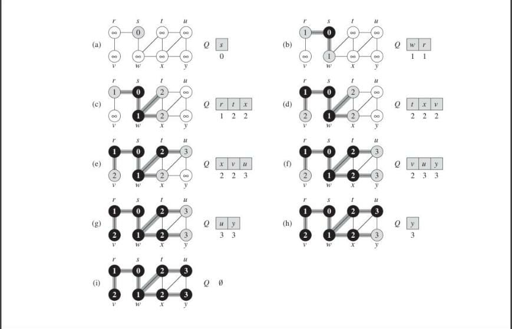
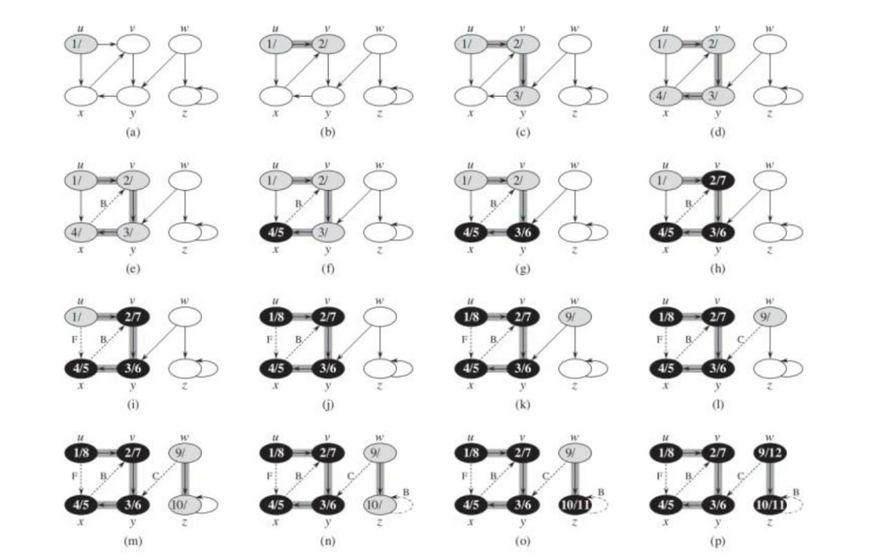
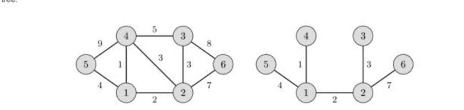
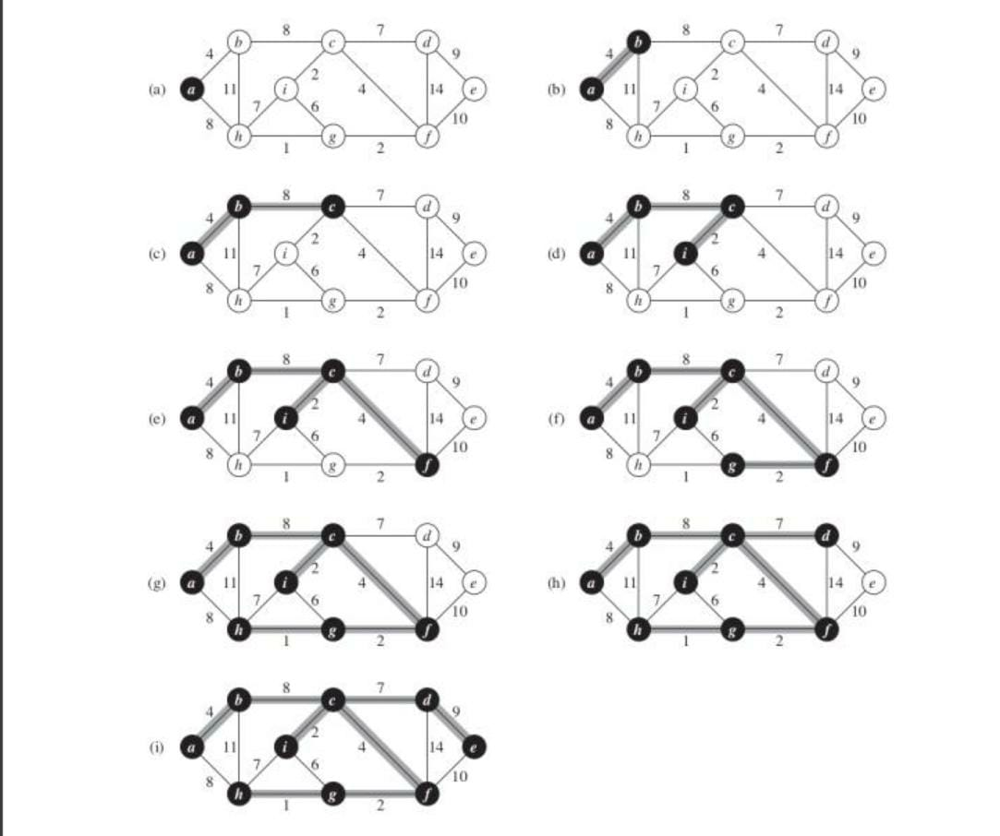
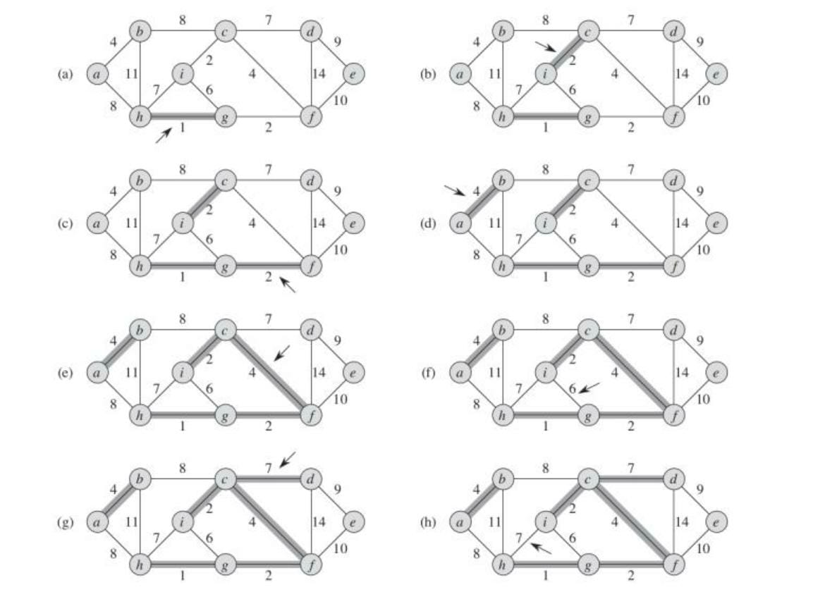
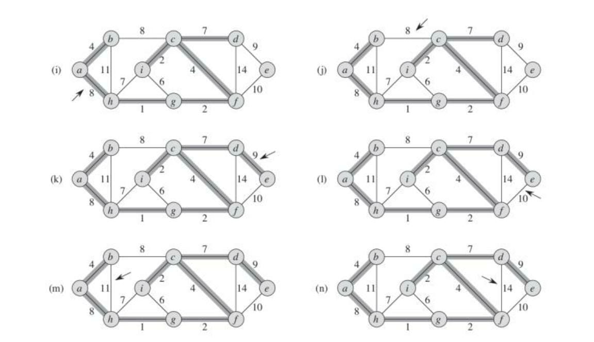
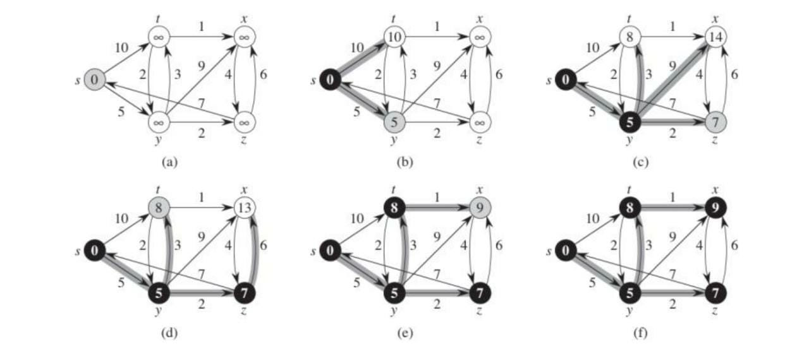

# CHAPTER 6: GRAPH ALGORITHMS

As we know, Graphs can either be constructed using an adjacency matrix (2D array) or an adjacency list. For the alforithms, I will be using an Adjacency List with the help of vectors in c++. Let us start by looking at some of the basic algorithms.

## Breadth First Search (BFS)

Breadth-first search is one of the simplest algorithms for searching a graph. Given a graph $G = (V,E)$ and a distinguished source vertex $s$, breadth-first search systematically explores the edges of $G$ to “discover” every vertex that is reachable from $s$. It computes the distance (smallest number of edges) from $s$ to each reachable vertex.

To keep track of progress, breadth-first search colors each vertex white, gray, or black. All vertices start out white and may later become gray and then black. A vertex is discovered the first time it is encountered during the search, at which time it becomes nonwhite. Gray and black vertices, therefore, have been discovered, but breadth-first search distinguishes between them to ensure that the search proceeds in a breadth-first manner. If $(u,v) \in E$ and vertex u is black, then vertex $v$ is either gray or black; that is, all vertices adjacent to black vertices have been discovered. Gray vertices may have some adjacent white verties; they represent the frontier between discovered and undiscovered vertices.

### Applications of DFS

- Find the shortest path from a source to other vertices in an unweighted graph.
- Find all connected components in an undirected graph in $O(n+m)$ time.
- Finding a solution to a problem or a game with the least number of moves, if each state of the game can be represented by a vertex of the graph, and the transitions from one state to the other are the edges of the graph.
- Finding the shortest cycle in a directed unweighted graph: Start a breadth-first search from each vertex. As soon as we try to go from the current vertex back to the source vertex, we have found the shortest cycle containing the source vertex. At this point we can stop the BFS, and start a new BFS from the next vertex. From all such cycles (at most one from each BFS) choose the shortest.

**Implementation**
```c++
#include <iostream>
#include <bits/stdc++.h>
using namespace std;

//directed unweighted graph

void bfs(int i, bool *visited, vector<vector<int>> graph)
{
    queue<int> q;
    q.push(i);
    visited[i] = true;

    while (!q.empty())
    {
        int node = q.front();
        cout << node << ' ';
        q.pop();
        visited[node] = true;

        for (int x = 0; x < graph[node].size(); x++)
        {
            if (!visited[graph[node][x]])
            {
                q.push(graph[node][x]);
                visited[graph[node][x]] = true;
            }
        }
    }
}

int main()
{
    int n, m;

    cin >> n >> m; //vertices and edges

    vector<vector<int>> graph(n + 1);
    bool *visited = new bool[n];
    for (int i = 0; i < n; i++)
    {
        visited[i] = false;
    }

    for (int i = 0; i < m; i++)
    {
        int a, b;
        cin >> a >> b;

        graph[a].push_back(b);
        graph[b].push_back(a);
    }

    for (int i = 1; i <= n; i++)
    {
        if (!visited[i])
        {
            bfs(i, visited, graph);
        }
    }

    //PRINTING THE GRAPH:
    for (int i = 1; i < graph.size(); i++)
    {
        for (int j = 0; j < graph[i].size(); j++)
        {
            cout << i << "->" << graph[i][j] << ' ';
        }
        cout << endl;
    }

    delete[] visited;
}
```



### Analysis
Let graph $G = (V,E)$

The operations of enqueuing and dequeuing take $O(1)$ time, and so the total time devoted to queue operations is $O(V)$. Because the procedure scans the adjacency list of each vertex only when the vertex is dequeued, it scans each adjacency list at most once. Since the sum of the lengths of all the adjacency lists is $\theta(E)$, the total time spent in scanning adjacency lists is $O(E)$. The overhead for initialization is $(O(V)$), and thus the total running time of the BFS procedure is $O(E+V)$. Thus, breadth-first search runs in time linear in the size of the adjacency-list representation of $G$.

### Practice Problems

[Problem 1](https://www.spoj.com/problems/WATER/)

[Problem 2](https://codeforces.com/contest/59/problem/E)

[Problem 3](https://codeforces.com/contest/796/problem/D)

[Problem 4](https://www.spoj.com/problems/DIGOKEYS/)


## Depth First Search (DFS)

The strategy followed by depth-first search is, as its name implies, to search “deeper” in the graph whenever possible. Depth-first search explores edges out of the most recently discovered vertex $v$ that still has unexplored edges leaving it. Once all of $v$’s edges have been explored, the search “backtracks” to explore edges leaving the vertex from which $v$ was discovered. This process continues until we have discovered all the vertices that are reachable from the original source vertex. If any undiscovered vertices remain, then depth-first search selects one of them as a new source, and it repeats the search from that source. The algorithm repeats this entire process until it has discovered every vertex.

### Applications of DFS

- Find any path in the graph from source vertex $u$ to all vertices.
- Find lexicographical first path in the graph from source $u$ to all vertices
- Topological sorting
- Check if a vertex in a tree is an ancestor of some other vertex
- Find strongly connected components in a directed graph


### Algorithm
The idea behind DFS is to go as deep into the graph as possible, and backtrack once you are at a vertex without any unvisited adjacent vertices.

It is very easy to describe / implement the algorithm recursively: We start the search at one vertex. After visiting a vertex, we further perform a DFS for each adjacent vertex that we haven't visited before. This way we visit all vertices that are reachable from the starting vertex.

**Implementation:**

```c++
#include <iostream>
#include <bits/stdc++.h>
using namespace std;

void dfs(vector<vector<int>> graph, int i, bool *visited)
{
    visited[i] = true;
    cout << i << endl;

    for (int x = 0; x < graph[i].size(); x++)
    {
        if (!visited[graph[i][x]])
        {
            dfs(graph, graph[i][x], visited);
        }
    }
}

int main()
{
    int n, m;

    cin >> n >> m; //vertices and edges

    vector<vector<int>> graph(n + 1);
    bool *visited = new bool[n];
    for (int i = 0; i < n; i++)
    {
        visited[i] = false;
    }

    for (int i = 0; i < m; i++)
    {
        int a, b;
        cin >> a >> b;

        graph[a].push_back(b);
        graph[b].push_back(a);
    }

    for (int i = 1; i <= n; i++)
    {
        if (!visited[i])
        {
            dfs(graph, i, visited);
        }
    }

    //PRINTING THE GRAPH:
    for (int i = 1; i < graph.size(); i++)
    {
        for (int j = 0; j < graph[i].size(); j++)
        {
            cout << i << "->" << graph[i][j] << ' ';
        }
        cout << endl;
    }

    delete[] visited;
}
```

Operation of DFS depicted pictorially:



> Complexity: $O(V+E)$


### Practice Problems

[Problem 1](https://codeforces.com/contest/727/problem/A)

[Problem 2](https://codeforces.com/contest/734/problem/E)

[Problem 3](https://codeforces.com/contest/723/problem/E)

[Problem 4](https://codeforces.com/contest/709/problem/E)

[Problem 5](https://codeforces.com/contest/710/problem/E)


## Minimum Spanning Trees

Given a weighted, undirected graph $G$ with $n$ vertices and $m$ edges. You want to find a spanning tree of this graph which connects all vertices and has the least weight (i.e. the sum of weights of edges is minimal). A spanning tree is a set of edges such that any vertex can reach any other by exactly one simple path. The spanning tree with the least weight is called a minimum spanning tree.

### Properties of an MST

- A minimum spanning tree of a graph is unique, if the weight of all the edges are distinct. Otherwise, there may be multiple minimum spanning trees. (Specific algorithms typically output one of the possible minimum spanning trees).
- Minimum spanning tree is also the tree with minimum product of weights of edges. (It can be easily proved by replacing the weights of all edges with their logarithms)
- In a minimum spanning tree of a graph, the maximum weight of an edge is the minimum possible from all possible spanning trees of that graph. (This follows from the validity of Kruskal's algorithm).
- The maximum spanning tree (spanning tree with the sum of weights of edges being maximum) of a graph can be obtained similarly to that of the minimum spanning tree, by changing the signs of the weights of all the edges to their opposite and then applying any of the minimum spanning tree algorithm.



## Prim's Algorithm

This algorithm was originally discovered by the Czech mathematician Vojtěch Jarník in 1930. However this algorithm is mostly known as Prim's algorithm after the American mathematician Robert Clay Prim, who rediscovered and republished it in 1957. Additionally Edsger Dijkstra published this algorithm in 1959.

### Algorithm

Here we describe the algorithm in its simplest form. The minimum spanning tree is built gradually by adding edges one at a time. At first the spanning tree consists only of a single vertex (chosen arbitrarily). Then the minimum weight edge outgoing from this vertex is selected and added to the spanning tree. After that the spanning tree already consists of two vertices. Now select and add the edge with the minimum weight that has one end in an already selected vertex (i.e. a vertex that is already part of the spanning tree), and the other end in an unselected vertex. And so on, i.e. every time we select and add the edge with minimal weight that connects one selected vertex with one unselected vertex. The process is repeated until the spanning tree contains all vertices (or equivalently until we have $n−1$ edges).

In the end the constructed spanning tree will be minimal. If the graph was originally not connected, then there doesn't exist a spanning tree, so the number of selected edges will be less than $n−1$.

**Implementation:**

```c++
#include <bits/stdc++.h>
using namespace std;

void prims(vector<vector<pair<int, int>>> &graph, int n)
{
    int v = 1, w = 0, sum = 0, cnt = 0;

    priority_queue<pair<int, int>, vector<pair<int, int>>, greater<pair<int, int>>> pq;
    int visited[n + 1] = {0};

    pq.push({w, v});

    while (!pq.empty())
    {
        pair<int, int> top = pq.top();
        pq.pop();

        v = top.second;
        w = top.first;

        if (visited[v] == 1)
            continue;
        visited[v] = 1;

        sum += w;
        cnt++;

        cout << v << " " << w << "\n";

        if (cnt >= n)
            break;

        for (int i = 0; i < graph[v].size(); i++)
        {
            int u = graph[v][i].second, w = graph[v][i].first;

            if (visited[u] == 1)
                continue;

            pq.push({w, u});
        }
    }

    cout << sum << "\n";
}

int main()
{

    int n, m;
    cin >> n >> m;

    vector<vector<pair<int, int>>> graph(n + 1);

    for (int i = 0; i < m; i++)
    {
        int u, v, w;
        cin >> u >> v >> w;
        graph[u].push_back({w, v});
        graph[v].push_back({w, u});
    }

    prims(graph, n);
}
```

> Complexity: $O(m*n)$




## Kruskal's Algorithm

This algorithm was described by Joseph Bernard Kruskal, Jr. in 1956.

Kruskal's algorithm initially places all the nodes of the original graph isolated from each other, to form a forest of single node trees, and then gradually merges these trees, combining at each iteration any two of all the trees with some edge of the original graph. Before the execution of the algorithm, all edges are sorted by weight (in non-decreasing order). Then begins the process of unification: pick all edges from the first to the last (in sorted order), and if the ends of the currently picked edge belong to different subtrees, these subtrees are combined, and the edge is added to the answer. After iterating through all the edges, all the vertices will belong to the same sub-tree, and we will get the answer.

**Implementation:**

```c++
#include <bits/stdc++.h>
using namespace std;

int find(vector<int> &parent, int u)
{
    if (parent[u] != u)
    {
        parent[u] = find(parent, parent[u]);
    }
    return parent[u];
}

void Union(vector<int> &rank, vector<int> &parent, int rootu, int rootv)
{
    if (rank[rootu] < rank[rootv])
    {
        parent[rootu] = rootv;
    }
    else if (rank[rootv] < rank[rootu])
    {
        parent[rootv] = rootu;
    }
    else
    {
        parent[rootv] = rootu;
        rank[rootu]++;
    }
}

void kruskal(vector<pair<int, pair<int, int>>> &edges, int n)
{
    vector<int> parent(n + 1);
    vector<int> rank(n + 1);

    for (int i = 1; i <= n; i++)
    {
        parent[i] = i;
        rank[i] = 0;
    }

    sort(edges.begin(), edges.end());

    int sum = 0, cnt = 0;

    for (int i = 0; i < edges.size(); i++)
    {
        int w = edges[i].first, u = edges[i].second.first, v = edges[i].second.second;

        int rootu = find(parent, u);
        int rootv = find(parent, v);

        if (rootu != rootv)
        {
            Union(rank, parent, rootu, rootv);
            sum += w;
            cnt++;

            cout << u << " " << v << " " << w << "\n";

            if (cnt >= n - 1)
                break;
        }
    }

    cout << sum << "\n";
}

int main()
{

    int n, m;
    cin >> n >> m;

    vector<pair<int, pair<int, int>>> edges;

    for (int i = 0; i < m; i++)
    {
        int u, v, w;
        cin >> u >> v >> w;
        edges.push_back({w, {u, v}});
    }

    kruskal(edges, n);
}
```





## Shortest Path in DAGs

Q. We have a directed acyclic graph (no cycles will be formed), with given edge weights and we need to find the shortest path from a source node to all the other reachable nodes of the graph.

The main idea for the algorithm is to create a topological ordering for the graph and calculate the minimum cost/ shortest path between 2 edges.

We will set the initial distance of source node = 0, and all the other nodes to be infinity. And then while traversing the graph and by using dynamic programming, we will update the values if we can find a better path to a given node.

### Implementation:

```c++
#include <iostream>
#include <bits/stdc++.h>
using namespace std;

// 1 is the source node

void printShortestPaths(int *a, int n)
{
    for (int i = 1; i < n + 1; i++)
    {
        cout << a[i] << " ";
    }
    cout << endl;
}

void Algo(bool *visited, vector<vector<pair<int, int>>> &graph, int *a)
{
    a[1] = 0;
    visited[1] = true;
    queue<int> q;
    q.push(1);

    while (!q.empty())
    {
        int node = q.front();
        q.pop();
        visited[node] = true;
        for (int i = 0; i < graph[node].size(); i++)
        {
            int x = graph[node][i].first;
            int y = graph[node][i].second;
            if (!visited[x])
            {
                q.push(x);
            }

            a[x] = min(a[x], a[node] + y);  // DYNAMICALLY UPDATING THE VALUES
        }
    }
}

int main()
{
    // n: number of vertices; m: number of edges
    int n, m;
    cin >> n >> m;

    vector<vector<pair<int, int>>> graph(n + 1);
    int *a = new int[n + 1];
    bool *visited = new bool[n + 1];
    for (int i = 0; i < n + 1; i++)
    {
        a[i] = INT_MAX;
        visited[i] = false;
    }

    for (int i = 0; i < m; i++)
    {
        int s, e, w;
        cin >> s >> e >> w;
        pair<int, int> p(e, w);
        graph[s].push_back(p);
    }

    Algo(visited, graph, a);
    printShortestPaths(a, n);

    delete[] a;
    delete[] visited;
}
```

> Longest path in a general graph is an NP-Hard problem but can be found easily for DAG's. We multiply all the edge weights by -1, and apply the same algorithm as for the shortest path. Then we again multiply by -1 while returning the answer!


## Dijkstra's Algorithm

You are given a directed or undirected weighted graph with n vertices and m edges. The weights of all edges are non-negative. You are also given a starting vertex $s$. This article discusses finding the lengths of the shortest paths from a starting vertex $s$ to all other vertices, and output the shortest paths themselves.

This problem is also called *single-source shortest paths problem*.

### Algorithm

Here is an algorithm described by the Dutch computer scientist Edsger W. Dijkstra in 1959.

Let's create an array $d[]$ where for each vertex $v$ we store the current length of the shortest path from $s$ to $v$ in $d[v]$. Initially $d[s]=0$, and for all other vertices this length equals infinity. In the implementation a sufficiently large number (which is guaranteed to be greater than any possible path length) is chosen as infinity.

$d[v] = \infty$   

$v \neq s$

In addition, we maintain a Boolean array $u[]$ which stores for each vertex v whether it's marked. Initially all vertices are unmarked: $u[v]=false$

The Dijkstra's algorithm runs for n iterations. At each iteration a vertex v is chosen as unmarked vertex which has the least value $d[v]$:

Evidently, in the first iteration the starting vertex s will be selected.

The selected vertex v is marked. Next, from vertex $v$ relaxations are performed: all edges of the form $(v,to)$ are considered, and for each vertex to the algorithm tries to improve the value $d[to]$. If the length of the current edge equals len, the code for relaxation is:

$d[to]=min(d[to],d[v]+len)$

After all such edges are considered, the current iteration ends. Finally, after n iterations, all vertices will be marked, and the algorithm terminates. We claim that the found values $d[v]$ are the lengths of shortest paths from $s$ to all vertices $v$.

Note that if some vertices are unreachable from the starting vertex $s$, the values $d[v]$ for them will remain infinite. Obviously, the last few iterations of the algorithm will choose those vertices, but no useful work will be done for them. Therefore, the algorithm can be stopped as soon as the selected vertex has infinite distance to it.

**Implementation:**

```c++
#include <bits/stdc++.h>
using namespace std;
#define INF 1e9

vector<int> dijkstra(vector<vector<pair<int, int>>> &graph, int s)
{
    int visited[graph.size()] = {0};

    priority_queue<pair<int, int>, vector<pair<int, int>>, greater<pair<int, int>>> pq;

    vector<int> dist(graph.size(), INF);

    dist[s] = 0;
    pq.push({dist[s], s});

    while (!pq.empty())
    {
        pair<int, int> top = pq.top();
        pq.pop();

        int u = top.second;

        if (visited[u] == 1)
            continue;
        visited[u] = 1;

        for (int i = 0; i < graph[u].size(); i++)
        {
            int v = graph[u][i].second, w = graph[u][i].first;

            if (visited[v] == 1)
                continue;

            if (dist[v] > dist[u] + w)
            {
                dist[v] = dist[u] + w;
                pq.push({dist[v], v});
            }
        }
    }

    return dist;
}

int main()
{

    int n, m;
    cin >> n >> m;

    vector<vector<pair<int, int>>> graph(n + 1);

    for (int i = 0; i < m; i++)
    {
        int u, v, w;
        cin >> u >> v >> w;
        graph[u].push_back({w, v});
    }

    int s;
    cin >> s;

    vector<int> dist = dijkstra(graph, s);

    for (int i = 1; i <= n; i++)
    {
        cout << "Distance from " << s << "to " << i << " is: " << dist[i] << "\n";
    }
}
```

> Complexity: $O(n^2 + m)$




### Practice Problems

[Problem 1](https://codeforces.com/problemset/problem/59/E)

[Problem 2](https://codeforces.com/problemset/problem/20/C)

[Problem 3](https://codeforces.com/problemset/problem/464/E)

[Problem 4](https://codeforces.com/contest/757/problem/F)


## Floyd Warshall Algorithm

Given a directed or an undirected weighted graph $G$ with $n$ vertices. The task is to find the length of the shortest path $dij$ between each pair of vertices $i$ and $j$.

The graph may have negative weight edges, but no negative weight cycles.

If there is such a negative cycle, you can just traverse this cycle over and over, in each iteration making the cost of the path smaller. So you can make certain paths arbitrarily small, or in other words that shortest path is undefined. That automatically means that an undirected graph cannot have any negative weight edges, as such an edge forms already a negative cycle as you can move back and forth along that edge as long as you like.

This algorithm can also be used to detect the presence of negative cycles. The graph has a negative cycle if at the end of the algorithm, the distance from a vertex v to itself is negative.

This algorithm has been simultaneously published in articles by Robert Floyd and Stephen Warshall in 1962. However, in 1959, Bernard Roy published essentially the same algorithm, but its publication went unnoticed.

### Algorithm

We initialize the solution matrix same as the input graph matrix as a first step. Then we update the solution matrix by considering all vertices as an intermediate vertex. The idea is to one by one pick all vertices and updates all shortest paths which include the picked vertex as an intermediate vertex in the shortest path. When we pick vertex number k as an intermediate vertex, we already have considered vertices ${0, 1, 2, .. k-1}$ as intermediate vertices. For every pair $(i, j)$ of the source and destination vertices respectively, there are two possible cases. 

1. $k$ is not an intermediate vertex in shortest path from $i$ to $j$. We keep the value of $dist[i][j]$ as it is. 
2. $k$ is an intermediate vertex in shortest path from $i$ to $j$. We update the value of $dist[i][j]$ as $dist[i][k] + dist[k][j]$ if $dist[i][j] > dist[i][k] + dist[k][j]$

**Implementation:**

```c++
#include <iostream>
#include <bits/stdc++.h>
using namespace std;

typedef long long int ll;
ll INF = 1e9 + 13;

bool check(vector<vector<ll>> &dp, int i, int j, int k)
{
    if (dp[i][j] > dp[i][k] + dp[k][j] && dp[i][k] != INF && dp[k][j] != INF)
    {
        return true;
    }
    return false;
}

int main()
{
    cout << "Enter the number of nodes and edges of graph: " << endl;
    int n, m;
    cin >> n >> m;

    vector<vector<ll>> v(n, vector<ll>(n, INF));

    cout << "Enter the edges and their weights: " << endl;
    for (int i = 0; i < m; i++)
    {
        int s, e, w;
        cin >> s >> e >> w;
        v[s][e] = w;
    }

    cout << "Enter the 2 nodes between which you want the shortest distance: " << endl;
    int x, y;
    cin >> x >> y;

    vector<vector<ll>> dp(n, vector<ll>(n, INF));
    for (int i = 0; i < n; i++)
    {
        for (int j = 0; j < n; j++)
        {
            dp[i][j] = v[i][j];
        }
    }

    // iterating the value of k:
    for (int k = 0; k < n; k++)
    {
        for (int i = 0; i < n; i++)
        {
            for (int j = 0; j < n; j++)
            {
                if (check(dp, i, j, k))
                {
                    dp[i][j] = dp[i][k] + dp[j][k];
                }
            }
        }
    }

    cout << "Answer: " << dp[x][y] << endl;
    return 0;
}
```

> Complexity: $O(n^3)$


## Toposort

Q. You are given a directed graph with $n$ vertices and $m$ edges. You have to number the vertices so that every edge leads from the vertex with a smaller number assigned to the vertex with a larger one.

In other words, you want to find a permutation of the vertices (*topological order*) which corresponds to the order defined by all edges of the graph.

Topological order can be non-unique (for example, if the graph is empty; or if there exist three vertices $a, b, c$ for which there exist paths from $a$ to $b$ and from $a$ to $c$ but not paths from $b$ to $c$ or from $c$ to $b$).

Topological order may not exist at all if the graph contains cycles (because there is a contradiction: there is a path from $a$ to $b$ and vice versa).

A common problem in which topological sorting occurs is the following. There are n variables with unknown values. For some variables we know that one of them is less than the other. You have to check whether these constraints are contradictory, and if not, output the variables in ascending order (if several answers are possible, output any of them). It is easy to notice that this is exactly the problem of finding topological order of a graph with $n$ vertices.


### Algorithm

To solve this problem we will use DFS.

Let's assume that the graph is acyclic, i.e. there is a solution. What does the depth-first search do? When started from some vertex $v$, it tries to run along all edges outgoing from $v$. It fails to run along the edges for which the opposite ends have been visited previously, and runs along the rest of the edges and starts from their ends.

Thus, by the time of the call $dfs(v)$ is ended, all vertices that are reachable from $v$ either directly (via one edge) or indirectly are already visited by the search. Therefore, if at the time of exit from $dfs(v)$ we add vertex $v$ to the beginning of a certain list, in the end this list will store a topological ordering of all vertices.

These explanations can also be presented in terms of time of exit from DFS routine. Exit time for vertex $v$ is the time at which $dfs(v)$ finished work (the times can be numbered from $1$ to $n$). It is easy to understand that exit time of any vertex $v$ is always greater than exit time of any vertex reachable from it (since they were visited either before the call $dfs(v)$ or during it). Thus, the desired topological ordering is sorting vertices in descending order of their exit times.

**Implementation:**

```c++
#include <iostream>
#include <bits/stdc++.h>
using namespace std;

int main()
{
    int n, m;
    cin >> n >> m;

    vector<vector<int>> graph(n + 1);
    vector<int> indegree(n + 1);
    for (int i = 1; i < n + 1; i++)
    {
        indegree[i] = 0;
    }

    for (int i = 0; i < m; i++)
    {
        int a, b;
        cin >> a >> b;
        graph[a].push_back(b);
        indegree[b]++;
    }

    queue<int> q;
    for (int i = 1; i < indegree.size(); i++)
    {
        if (indegree[i] == 0)
        {
            q.push(i);
        }
    }

    while (!q.empty())
    {
        int node = q.front();
        q.pop();
        cout << node << ' ';

        for (int i = 0; i < graph[node].size(); i++)
        {
            int x = graph[node][i];
            indegree[x]--;
            if (indegree[x] == 0)
            {
                q.push(x);
            }
        }
    }
    cout << endl;
}
```

### Practice Problems

[Problem 1](https://www.spoj.com/problems/TOPOSORT/)

[Problem 2](https://codeforces.com/problemset/problem/510/C)
