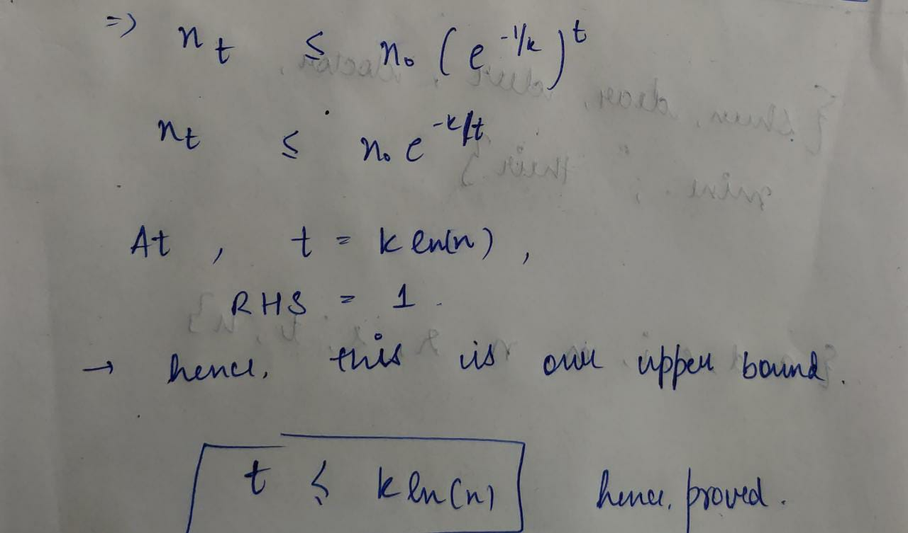

# CHAPTER 4: GREEDY ALGORITHMS

A greedy algorithm always makes the choice that looks best at
the moment. That is, it makes a locally optimal choice in the hope that this choice
will lead to a globally optimal solution.

Note that it is not necessary that a greedy algorithm will necessarily give the optimal solution. Sometimes, it may fail.

## Elements of the greedy strategy

1. Determine the optimal substructure of the problem.
2. Develop a recursive solution.
3. Show that if we make the greedy choice, then only one subproblem remains.
4. Prove that it is always safe to make the greedy choice. (Steps 3 and 4 can occur
in either order.)
5. Develop a recursive algorithm that implements the greedy strategy.
6. Convert the recursive algorithm to an iterative algorithm.

**Greedy Choice Property**
A ingredient is the greedy-choice property: we can assemble a globally optimal solution by making locally optimal (greedy) choices. In other words, when we are considering which choice to make, we make the choice that looks best in the current problem, without considering results from subproblems.

**Optimal Substructure**
A problem exhibits optimal substructure if an optimal solution to the problem contains within it optimal solutions to subproblems. This property is a key ingredient of assessing the applicability of dynamic programming as well as greedy algorithms.

> A major application of these algorithms is the Huffman codes.

## Huffman Codes

We know that generally we allocate 1 bit to store one character and 4 bits i.e. 1 byte to store an int. However, such an allocation of memory may not always be optimal. An optimal solution would be to allocate memory according to the frequency of the occurence of characters in a document, allocating lesser memory to more frequently occuring characters, and vice versa. Huffman Codes is an algorithm to do just that.

Huffman codes compress data very effectively: savings of 20% to 90% are typical, depending on the characteristics of the data being compressed. We consider the data to be a sequence of characters. Huffman’s greedy algorithm uses a table giving how often each character occurs (i.e., its frequency) to build up an optimal way of representing each character as a binary string.

Now we shall consider an example and see how Huffman encoding works. Then we shall also look at the implementation of the algorithm.

**Example:** 
| Symbol | Frequency |
|--------|-----------|
| A      | 70        |
| B      | 3         |
| C      | 20        |
| D      | 37        |

One possible method is to use 2 bits for each symbol (since there are 4 symbols in total). 

Memory needed for implementation: $2*(70+3+20+37) = 260$ bytes

*But can we do better? YES!*

### Variable length encoding:
| Symbol | Codeword |
|--------|----------|
| A      | 0        |
| B      | 100      |
| C      | 101      |
| D      | 11       |


For the following encoding, cost = $ (1*70) + (3*3) + (3*20) + (2*37) = 213$ bytes.

Hence this is an improvement over the initial usage of memory.


### How did we arrive at this encoding?

By Greedy Method, of course!

1. The Greedy Choice: The 2 symbols with the smallest frequencies must be at the bottom of the lowest internal node. If this was not the case, swapping these 2 symbols with whatever is lowest in the tree would improve our coding.

2. Optimum Substructure: The frequncy of any internal node to be the sum of the frequencies of its descendent leaves. The cost of the trees is the sum of the frequencies of all leaves and internal nodes, except the root.

### Algorithm for Huffman Coding (in python):

```python
# reading from a file and storing the text:
with open('sample.txt', 'r') as f:
    text = f.read()

# empty lists for alphabets and their frequencies
freq = []
chars = set()

# initialise freq list:
for i in range(26):
    freq.append(0)

# calculating frequencies of characters:
for char in range(0,len(text)):
    index = -1
    ch = ''
    if text[char] >= 'A' and text[char] <= 'Z':
        index = ord(text[char]) - 65
        ch = chr(ord(text[char]) + 32)
    elif text[char] >= 'a' and text[char] <= 'z':
        index = ord(text[char]) - 97
        ch = text[char]
    freq[index] += 1
    if(ch != ''):
        chars.add(ch)

chars = list(chars)
chars.sort()

for i in list(freq):
    if i == 0:
        freq.remove(i)

# A Huffman Tree Node
class node:
	def __init__(self, freq, symbol, left=None, right=None):
		self.freq = freq
		self.symbol = symbol
		self.left = left
		self.right = right
		self.huff = ''


my_dict = {}
def makeDict(node, val=''):
	newVal = val + str(node.huff)

	if(node.left):
		makeDict(node.left, newVal)
	if(node.right):
		makeDict(node.right, newVal)

	if(not node.left and not node.right):
         my_dict[node.symbol] = newVal

# list containing unused nodes
nodes = []

# converting characters and frequencies
# into huffman tree nodes
for x in range(len(chars)):
	nodes.append(node(freq[x], chars[x]))

while len(nodes) > 1:
	nodes = sorted(nodes, key=lambda x: x.freq)

	left = nodes[0]
	right = nodes[1]

	left.huff = 0
	right.huff = 1

	newNode = node(left.freq+right.freq, left.symbol+right.symbol, left, right)

	nodes.remove(left)
	nodes.remove(right)
	nodes.append(newNode)

# Huffman Tree is ready!
makeDict(nodes[0])
print(my_dict.items())
```


Now let us look at another problem statement that makes use of the Greedy strategy. This time we shall not necessarily obtain the optimal solution but the solution would still be preferred keeping in mind the better time complexity of greedy algorithms.

## The Set Cover Problem

Input: A set of elements B; sets S1, S2, ...., Sn are a subset of B

Output: A selection of the Si whose union is B.
Cost: Number of sets picked.

### Example:

Consider each of the following words as a set of letters:

{$shun,dear,deer,doctor,mine,their$}

To cover the Set B:

{$a,d,e,i,m,n,r,s,t,u$}

#### A Greedy Algorithm:

Repeat until all sets of B are covered.
Pick the set Si with the largest number of uncovered elements.

For our example:

- First pick: dear (4 uncovered letters)
- uncovered: {$i,m,n,s,t,u$}
- Second pick: shun (3 uncovered letters)
- uncovered: {$i,m,t$}
- Third pick: mine (2 uncovered letters)
- uncovered letters: {$t$}
- Fourth pick: their

> However such a method may NOT always be optimum.

### Counter Example:

To cover set B = {$1,2,3,4,5,6$}
Set family: {$1,2,3,4$} , {$$} , {$2,4,6$}

- Our greedy algorithm would pick all 3 sets, while the optimum solution is 2 (2nd and 3rd set).

**However, we would still prefer the Greedy solution because our set is NP-complete i.e. no optimal solution has yet been found for such a problem. Hence, it is advisable to give priority to better Time Complexity over the correct solution.**

> Claim: Let set B contains n elements and that the optimal cover of k sets. Then our greedy algorithm will use at most $kln(n)$ sets.





## Other Examples (Competitive Programming)

[Problem 1](https://codeforces.com/problemset/problem/1550/A)

### Solution
```c++
#include <iostream>
#include <bits/stdc++.h>
using namespace std;

typedef long long ll;

void solve()
{
    int s; cin >> s;
    int ans = 1,num=1;
    s-=1;

    while(s>0){
        if(s>=num+2){
            num+=2;
            s-=num;
            ans++;
        }
        else{
            ans++;
            break;
        }
        
    }
    cout << ans << endl;
}

int main()
{
    int t;
    cin >> t;
    while (t--)
    {
        solve();
    }
}
```

[Problem 2](https://codeforces.com/problemset/problem/1606/B)

### Solution
```c++
#include <iostream>
#include <bits/stdc++.h>
using namespace std;

typedef long long int ll;

void solve()
{
    ll n, k;
    cin >> n >> k;
    ll ans = 0;
    ll pwsofar = 0;
    --n;
    while (n)
    {
        ll pw = (1LL << pwsofar);
        if (pw > k)
        {
            break;
        }
        if (pw >= n)
        {
            n = 0;
            ++ans;
            break;
        }
        n -= (1LL << pwsofar);
        ++ans;
        pwsofar++;
    }

    ll need = ceil(n / (long double)k);
    ans = ans + need;
    cout << ans << '\n';
}

int main()
{
    int t;
    cin >> t;
    while (t--)
    {
        solve();
    }

    return 0;
}
```

[Problem 3](https://codeforces.com/problemset/problem/1579/C)

### Solution
```c++
#include <iostream>
#include <bits/stdc++.h>
#include <assert.h>
using namespace std;

#define quick   \
    cin.tie(0); \
    ios_base::sync_with_stdio(false);

int grid[25][25];
void tick(int x, int y, int d)
{
    if (x < d || y < d)
        return;
    for (int i = 0; i <= d; i++)
    {
        if (!grid[x - i][y - i] || !grid[x - i][y + i])
            return;
    }
    for (int i = 0; i <= d; i++)
    {
        ++grid[x - i][y - i];
        ++grid[x - i][y + i];
    }
}

void solve()
{
    int n, m, k;
    cin >> n >> m >> k;
    for (int i = 0; i < n; i++)
    {
        string s;
        cin >> s;
        for (int j = 0; j < m; j++)
            grid[i][j] = s[j] == '*';
    }
    for (int i = 0; i < n; i++)
        for (int j = 0; j < m; j++)
            for (int d = k; j + d < m; d++)
                tick(i, j, d);
    bool ok = true;
    for (int i = 0; i < n; i++)
        for (int j = 0; j < m; j++)
            if (grid[i][j] == 1)
                ok = false;
    cout << (ok ? "YES" : "NO") << endl;
}

int main()
{
    quick

        int t;
    cin >> t;
    while (t--)
    {
        solve();
    }
}
```

## Practice Problems

[Problem 1](https://codeforces.com/problemset/problem/1062/A)

[Problem 2](https://codeforces.com/problemset/problem/1180/B)

[Problem 3](https://codeforces.com/problemset/problem/387/C)
