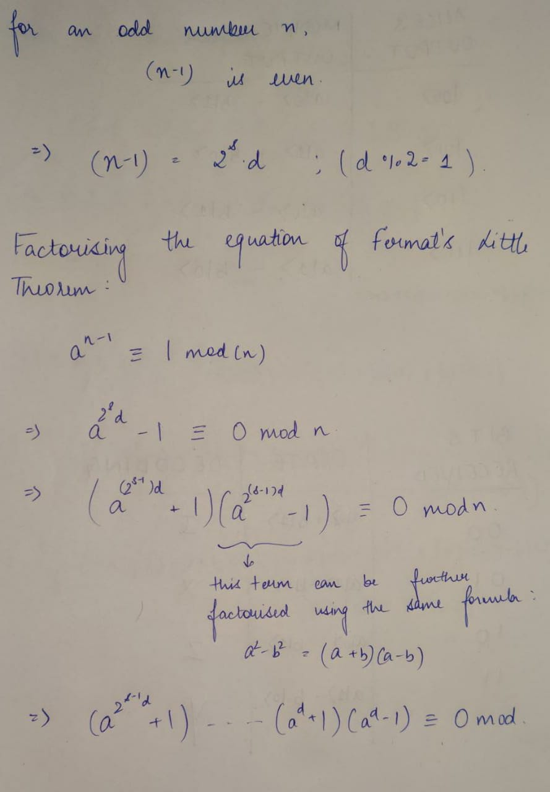

# Primality Testing

Now we will se various techniques to tell whether a number is prime or not. This is widely used not only in various competitive programming problems, but also has many cryptographic based applications.

## Trial Division
This is a simple algorithm which uses a theorem from Discrete Structures which says that for a composite number, there must be at least one divisior which is lesser than or equal to $\sqrt n$.

**Code**

```c++
#include <iostream>
#include <bits/stdc++.h>
using namespace std;

bool isPrime(int x)
{
    for (int d = 2; d * d <= x; d++)
    {
        if (x % d == 0)
            return false;
    }
    return true;
}

int main()
{
    cout << "enter n: ";
    int n;
    cin >> n;

    if(isPrime(n)){
        cout << "number is prime" << endl;
    }
    else{
        cout << "number is composite" << endl;
    }

    return 0;
}
```

> Complexity: $O(\sqrt n)$

## Fermat Primality Test

Fermat's little theorem states, that for a prime number p and a coprime integer a the following equation holds:
$a^x ≡ 1 mod(p)$ where $x=p-1$.

This theorem can be used to check if a number is prime or not. Let us say, we pick any random natural number, we check if the equation holds. If it does not hold, the number is composite. However, it is also possible that the equation holds for a composite number. In such a case it is impossible for us to tell whether the number is prime or not.

A way around this is to run the algorithm sufficient number of times for different, random values of $a$, and if the equation holds for all the iterations, we can say that the number is *most likely prime*.


## Miller Rabin Primality Test

It is an extension of the ideas of Fermat's Theorem. 



If $n$ is prime, the $n$ has to divide one of the factors mentioned in the final equation. 

**Code**

```python
import random

def miller_rabin_method(number: int, rounds: int = 40)-> bool:
    if number == 1:
        return False
    if number == 2:
        return True
    if number == 3:
        return True

    # Factor out the powers of 2 from {number - 1} and save the result
    d = number - 1
    r = 0
    while not d & 1:
        d = d >> 1
        r += 1

    # Cycle at most {round} times
    for i in range(rounds + 1):
        a = random.randint(2, number - 2)
        x = pow(a, d, number)
        if x == 1 or x == number - 1:
            continue
        # Cycle at most {r - 1} times
        for e in range(r):
            x = x * x % number
            if x == number - 1:
                break
        if x == number - 1:
            continue
        return False
    return True


if __name__ == "__main__":
    count = 0
    upper_bound = 1000
    print(f"Prime numbers lower than {upper_bound}:")
    for i in range(1, 1000):
        if miller_rabin_method(i):
            print(f"\t{i}")
            count += 1
    print(f"Total: {count}")
```

### Practice Problem:

[Problem 1](https://www.spoj.com/problems/PON/)